# <span style="background-color: tomato; color: white; padding-left: 5px">SETTING UP DEV COLLECTIVE AND FIRST PULL REQUEST</span>
---

### <span style="color: orange">FORKING AND CLONING REPO</span>
---

###### 1. <span style="color: dodgerblue">Go to <strong style="color: orange">DEV COLLECTIVE MASTER REPO</strong> repo at: </span>[https://github.com/Mintbean/DevCollective.io](https://github.com/Mintbean/DevCollective.io "Dev Collective Master repo link")
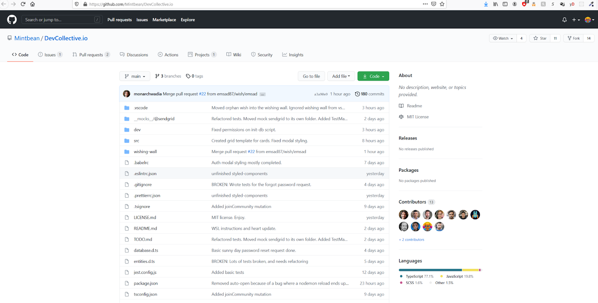

###### 2. <span style="color: dodgerblue"><strong style="color: orange">FORK</strong> the repo to your own GitHub account</span>
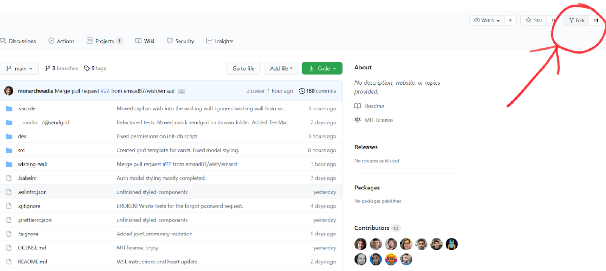

###### 3. <span style="color: dodgerblue">Now inside your personal forked repo, copy the <strong style="color: orange">CLONE</strong> URL</span>
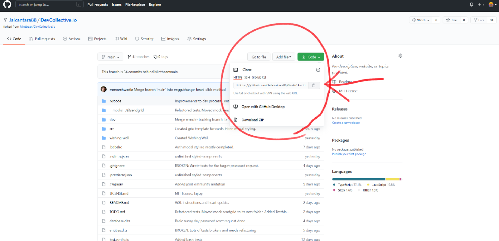

###### 4. <span style="color: dodgerblue"><strong style="color: orange">CREATE A FOLDER</strong> on your computer (wherever you want the project to live locally)</span>
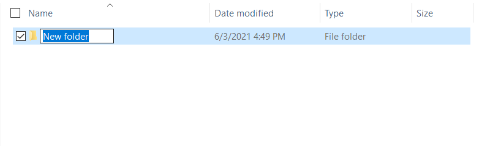

###### 5. <span style="color: dodgerblue">Open the folder in <strong style="color: orange">VS CODE</strong> (or your preferred code editor)</span>
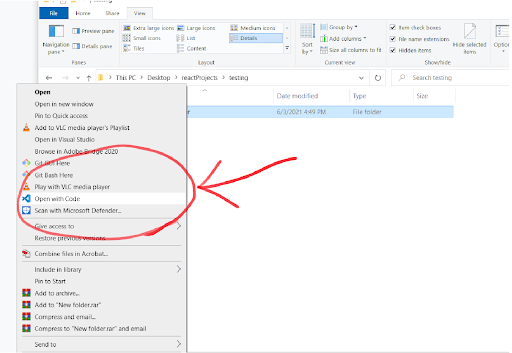

###### 6. <span style="color: dodgerblue">In the terminal <strong style="color: orange">RUN:</strong></span>
```git clone theCloneURLyouGrabbedinStep3```

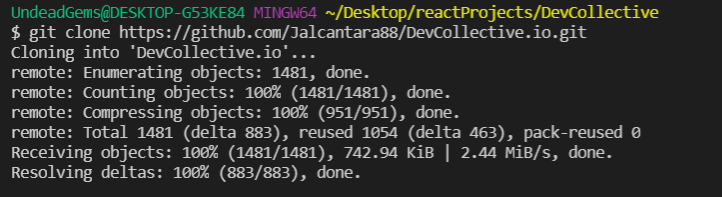

###### 7. <span style="color: dodgerblue">Then <strong style="color: orange">RUN:</strong></span>
```cd DevCollective.io```

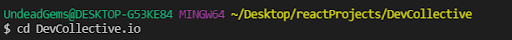

###### 8. <span style="color: dodgerblue">You can now make the changes you wish to make</span>

---

### <span style="color: orange">FIRST PULL REQUEST</span>
---

###### 1. <span style="color: dodgerblue">Once you are ready to start a pull request for review you can <strong style="color: orange">RUN:</strong></span> 
```git checkout -b exampleCategory/exampleName```

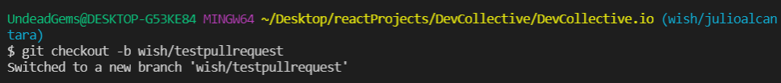

###### 2. <span style="color: dodgerblue">You have just created a branch. What you call this <strong style="color: orange">CATEGORY/NAME</strong> is just for the sake of organization and can be anything</span>

###### 3. <span style="color: dodgerblue">You can now <strong style="color: orange">RUN:</strong></span>
```git add .```

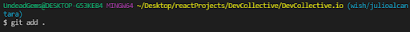

###### 4. <span style="color: dodgerblue">Then you can name your commit. <strong style="color: orange">RUN:</strong></span>
```git commit -m "example name of commit"```

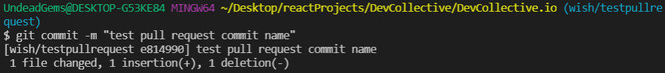

###### 5. <span style="color: dodgerblue">After this you are ready to push the changes to the branch you just created. <strong style="color: orange">RUN:</strong></span>
```git push -u origin exampleCategory/exampleName```

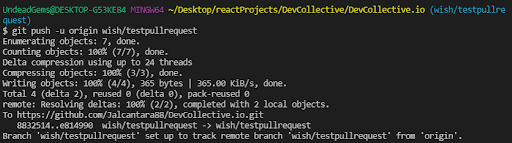

###### 6. <span style="color: dodgerblue">Your branch now has one commit in it. You can now log on to your <strong style="color: orange">FORKED GIT REPO</strong></span>

###### 7. <span style="color: dodgerblue">To start your first pull request, click on the button <strong style="color: orange">PULL REQUESTS</strong></span>
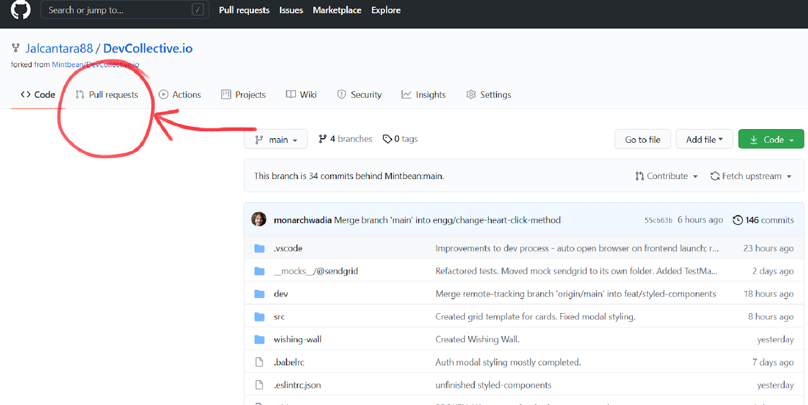

###### 8. <span style="color: dodgerblue">Click on create <strong style="color: orange">COMPARE & PULL REQUEST</strong></span>
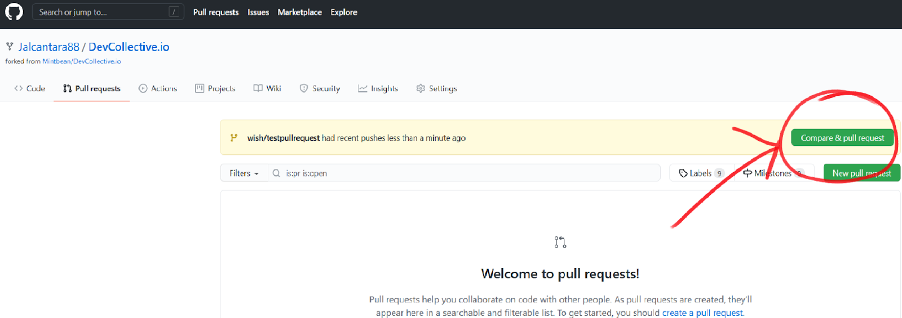

###### 9. <span style="color: dodgerblue">Make sure the <strong style="color: orange">DEV COLLECTIVE MASTER</strong> is on the left</span>
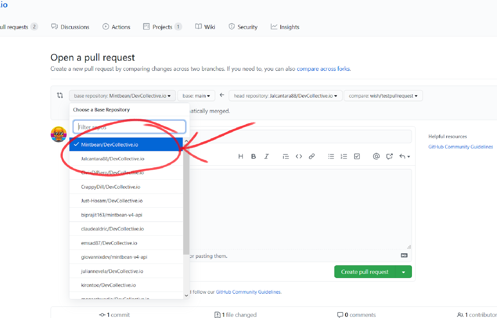

###### 10. <span style="color: dodgerblue">On the right side set compare to the <strong style="color: orange">BRANCH YOU JUST CREATED</strong></span>
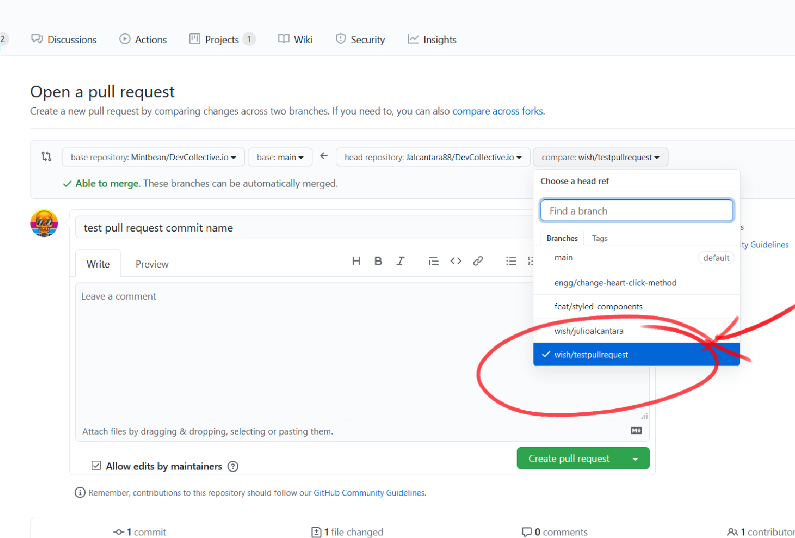

###### 11. <span style="color: dodgerblue">Write a comment to go with your Pull Request (Probably something explaining the request purpose) and then click <strong style="color: orange">CREATE PULL REQUEST</strong></span>
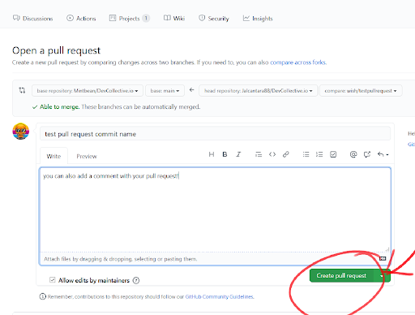

###### 12. <span style="color: orange">CONGRATS ON CREATING YOUR FIRST PULL REQUEST!</span> <span style="color: dodgerblue">The request will either be accepted and merged with the Master Branch or you will receive a review in response to your pull request</span>
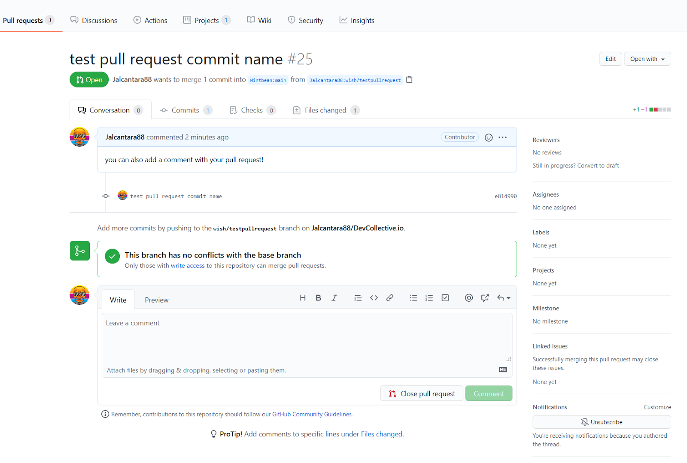

---

### <span style="color: orange">WHAT TO DO IF YOU GET A REVIEW WITH A COMMENT</span>
---

###### 1. <span style="color: dodgerblue">You may get a <strong style="color: orange">RESPONSE</strong> to your pull request. This is usually a change or clarification of what you want to push to the master branch</span>
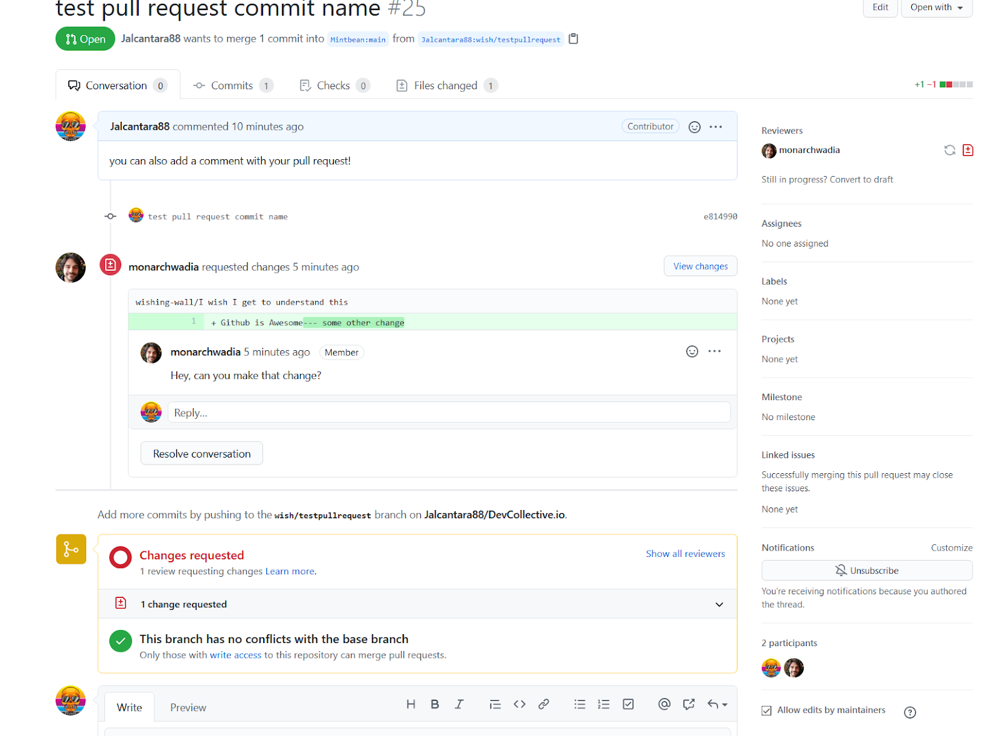

###### 2. <span style="color: dodgerblue">Open the <strong style="color: orange">VIEW CHANGES</strong> to read what was sent to you</span>
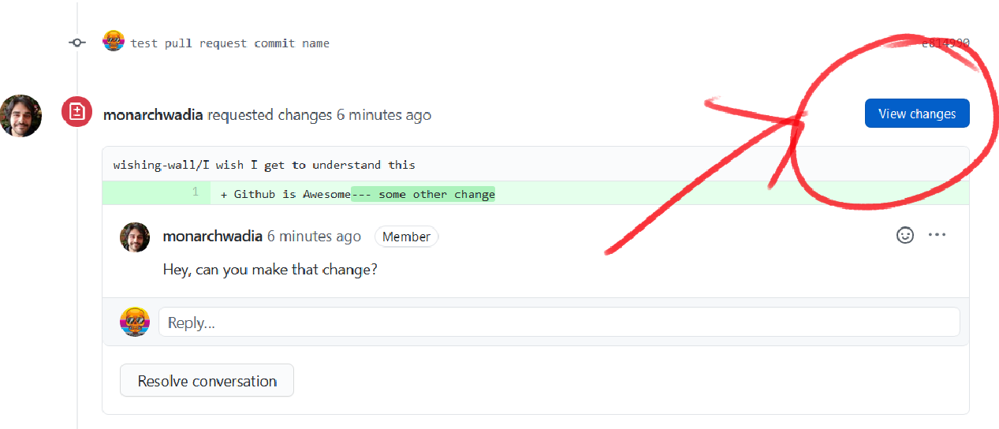

###### 3. <span style="color: dodgerblue">You now have a few options. First, you can simply respond to the comment and <strong style="color: orange">COMMENT BACK</strong></span>
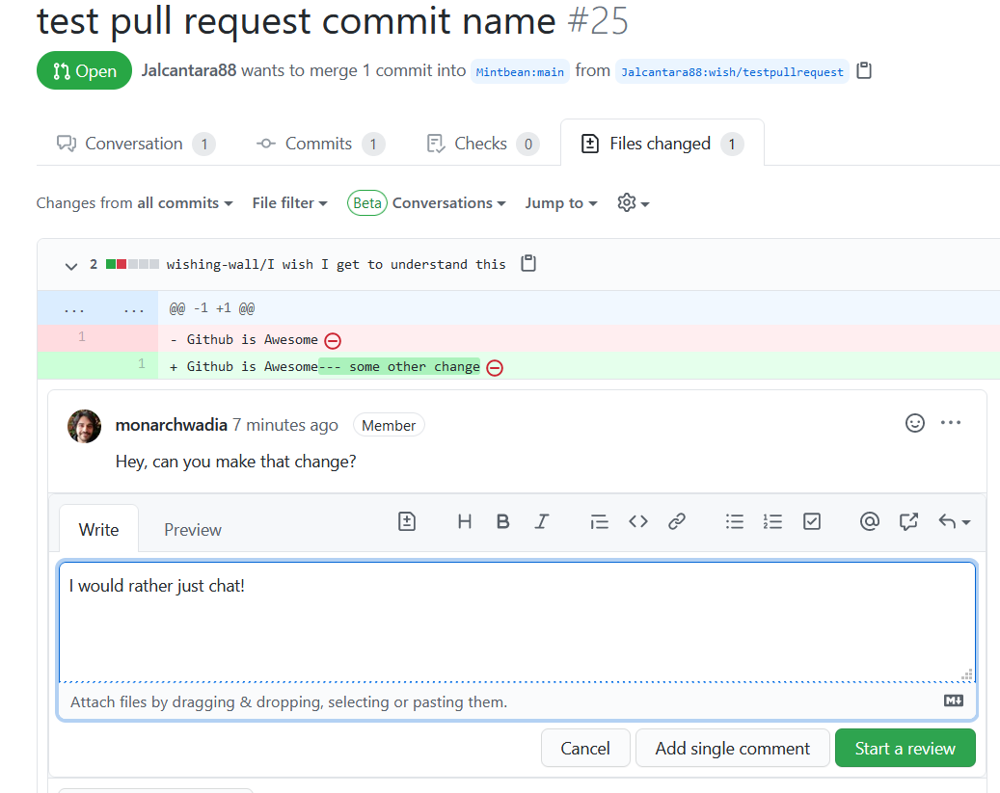

###### 4. <span style="color: dodgerblue">You can also go back a page and <strong style="color: orange">CLOSE WITH COMMENT</strong> to close the pull request out and leave a comment in doing so as to the reason for the close</span>
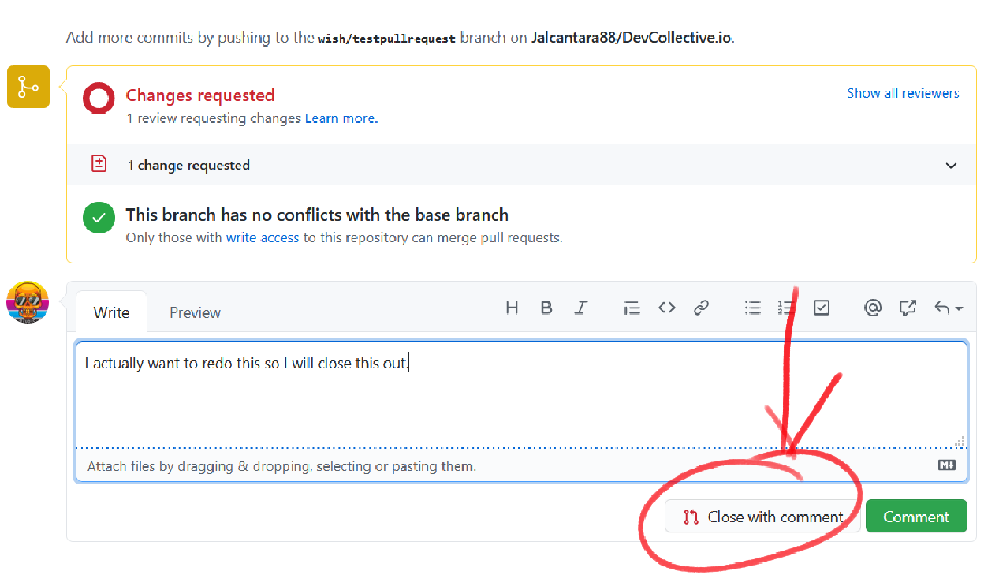

###### 5. <span style="color: dodgerblue">You can also <strong style="color: orange">CLOSE PULL REQUEST</strong> without commenting back</span>
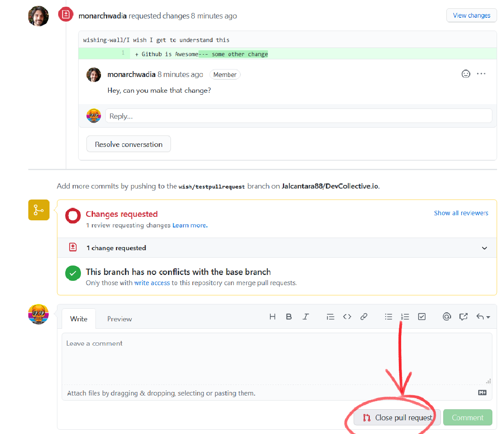

###### 6. <span style="color: dodgerblue">Or you can make more changes to your file and <strong style="color: orange">ADD TO PULL REQUEST</strong>. You can do this by following the next few steps:</span>

###### 7. <span style="color: dodgerblue">Make more changes to the local repo</span>

###### 8. <span style="color: dodgerblue">Then you can <strong style="color: orange">RUN:</strong></span>
```git add .```
###### 9. <span style="color: dodgerblue">Next you can <strong style="color: orange">RUN:</strong></span>
```git commit -m "a new name for this new commit"```

###### 10. <span style="color: dodgerblue">Then you can <strong style="color: orange">RUN:</strong></span> 
```git push -u origin exampleCategory/exampleName```
###### <span style="color: dodgerblue">(this should be the same branch name that you have created at the beginning of this)</span>

###### 11. <span style="color: dodgerblue">So you have basically just <strong style="color: orange">ADDED ANOTHER COMMIT</strong> to the branch you created at the start of all of this.</span>
  * <span style="color: dodgerblue">You can do this as many times as necessary until the changes have been approved and the branch you created with all the commits attached gets merged into the Master Branch or the Pull Request is closed.</span>
  * <span style="color: dodgerblue">Every time you make a new Pull Request and a created branch to it, all the commits pushed to that branch are part of the same Pull Request.</span>

###### 12. <span style="color:orange">CONGRATS ON YOUR FIRST MERGE AND CONTRIBUTION TO AN OPEN SOURCE PROJECT!!!</span>

