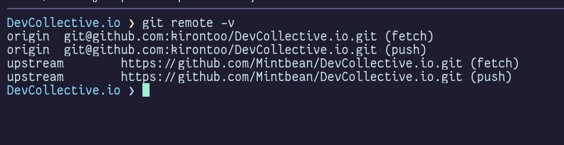
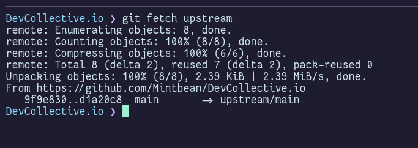
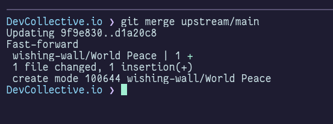
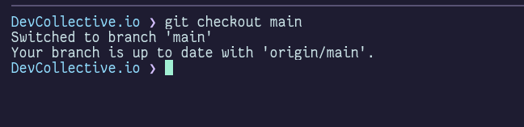
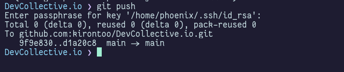

# How to sync your repo with updated code
 
**Prerequisite**: A fork of the DevCollective repo. 

Please follow this [guide](./FirstPullRequest.md) if you haven't yet.

##### 1. Navigate into your fork of the DevCollective Repo

Make sure you have a git remote configured for the upstream (original/source) repository.
You can check your current remotes with this command:

```bash
git remote
```


If you don't have the `upstream` output, run this command:
```bash
git remote add upstream https://github.com/Mintbean/DevCollective.io.git
```

Then check your remotes again.
```bash
git remote -v
```

Should look something like this:




##### 2. Fetch updated code from the original repo
```bash
git fetch upstream
```


##### 3. Merge it into your main branch
```bash
git merge upstream/main
```

The output should look something like this:




##### 4. Push updated code to your fork of the repo on github
Make sure you are on the `main` branch first.
```bash
git checkout main
```



Then run:

```bash
git push
```



**You have now updated your forked repo!**
